| Name              | Version | Status        | Started | Type    |
| ----------------- | ------- | ------------- | ------- | ------- |
| Pixel art samples | v0.1    | 🟢 Maintained | 2025    | Samples |

## About

This is a collection of some of my pixel art I have made throughout the years. I have used them in my personal hobby projects like desktop programs and mini games.

## Content

### Icons

Book
Film
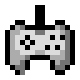Gamepad
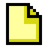New file
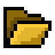Open file
Save file
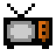TV
Info floating
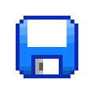Save floating

### Icons and design used in a program

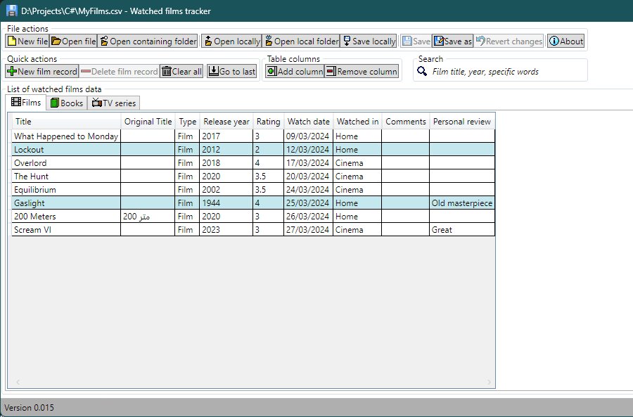Pixel icons in use

### Game pixel art

#### Game mockups

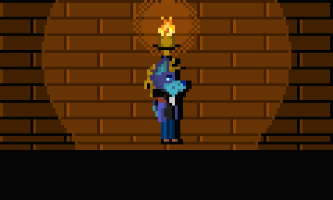Torch and temple
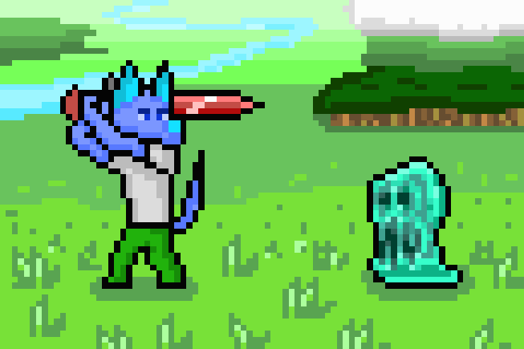Slime battle
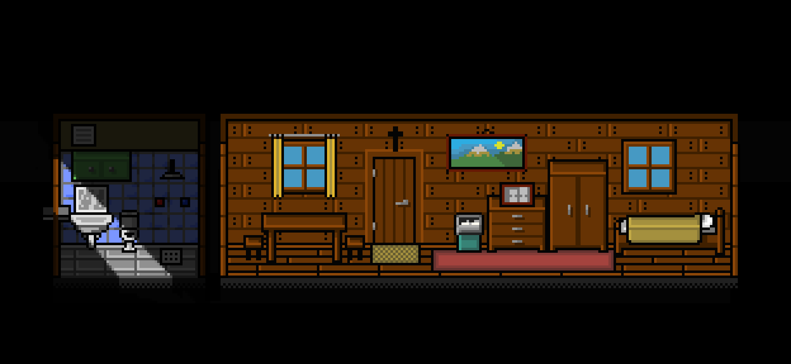Cabin with light and shadow

#### Game sprite Gifs

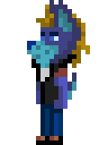Player walking left
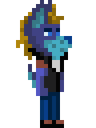Player walking right
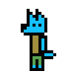Player walking left
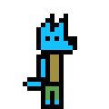Player walking right
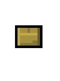Box open animation
Explosion animation

Decreasing health level heart shine. (This GIF may not play correctly on GitHub. Click to open in a new tab.)

Full heart shine. (This GIF may not play correctly on GitHub. Click to open in a new tab.)

Sparkle1
Sparkle2
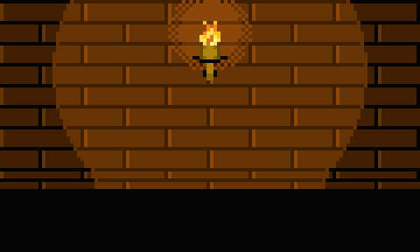Torch animation
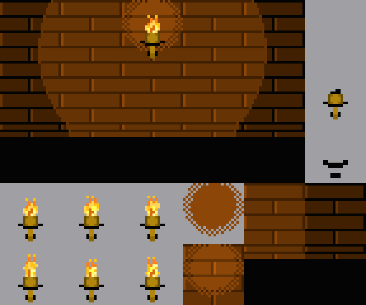Torch tileset

## Tools I Use

- **Draw pixel art:** Character Maker 1999
- **Make background transparent:** Paint.NET
- **Slice sprite sheets:** Free TexturePacker GUI
- **Create GIFs:** ScreenToGif
- **Write Markdown files:**
  - Microsoft Visual Studio
  - Notepad++ with MarkdownPanel plugin
